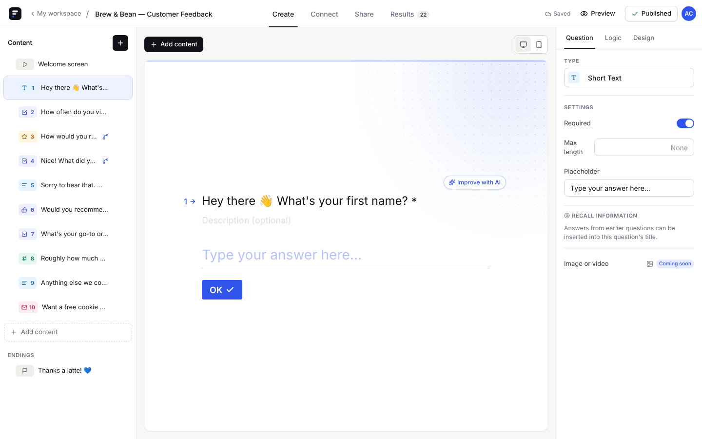
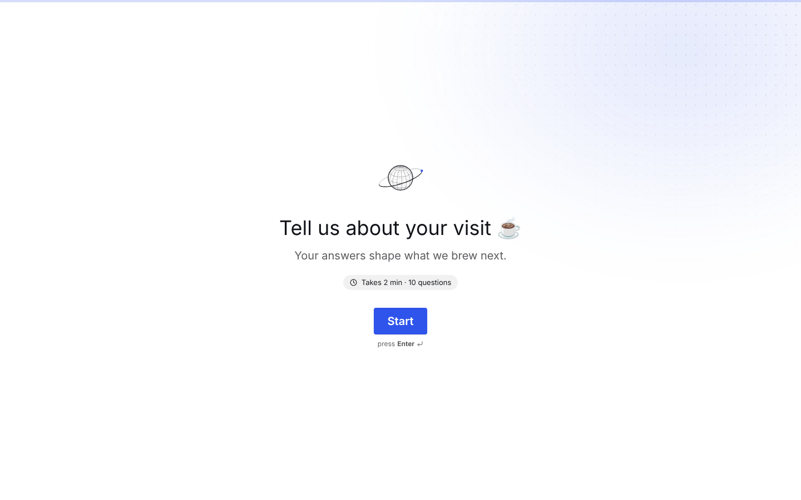
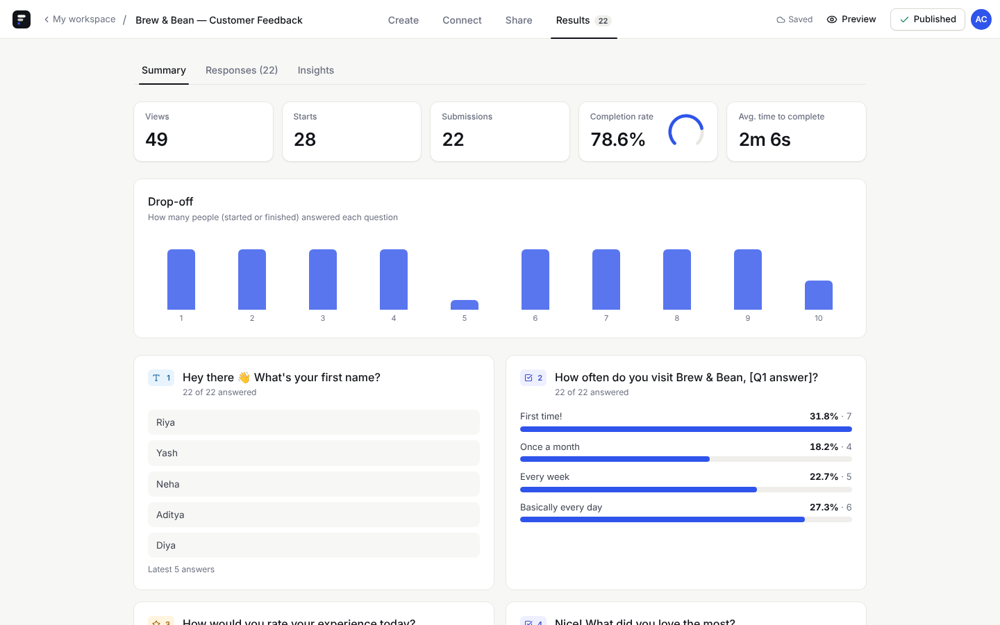

# Formwise — a Typeform-style form builder

A full-stack clone of the Typeform experience: build forms in a drag-and-drop builder with a live preview, publish them to a shareable link, collect answers through the one-question-at-a-time conversational flow, and analyse results.

The layout and interaction patterns follow Typeform closely. The visual design ("Studio") is original: a quiet neutral base with one cobalt accent, Inter for the UI and Instrument Serif for headlines, plus a few small line-art details computed from equations.

| | |
|---|---|
| **Frontend** | Next.js 16 (App Router, TypeScript, static export) · Tailwind CSS v4 · Motion (animations) · dnd-kit (drag & drop) · lucide icons · procedural SVG accents · Inter + Instrument Serif (self-hosted) |
| **Backend** | Python 3.12 · FastAPI · SQLAlchemy 2 · Pydantic v2 |
| **Database** | SQLite |
| **AI** | Hugging Face Inference router (OpenAI-compatible chat completions), with an offline fallback |
| **Hosting** | Frontend on Cloudflare Pages · Backend on Render (see [DEPLOYMENT.md](DEPLOYMENT.md)) |

| Builder | Respondent |
|---|---|
|  |  |
|  |  |

---

## Features

### Core (required)
- **Form builder.** Three panes like Typeform: a sortable question list (drag & drop), a canvas with a live preview where you edit titles, descriptions and choices inline, and a settings panel. It also has an "Add content" picker, a type switcher, a required toggle, help text, placeholders, min/max, multi-select, rating steps, duplicate and delete (with undo). Changes autosave and the header shows the save state.
- **Question types:** short text, long text, multiple choice (single or multi), dropdown (searchable), email, number, yes/no, rating. Phone, date, file upload, payment, ranking and other types are listed as *Coming soon*.
- **Form management:** list with status (Draft/Live), response count and last-updated time. You can create, rename, duplicate, delete, publish/unpublish, move between workspaces, search, sort, and switch between list and grid views.
- **Respondent flow:** one question per full-screen page with vertical slide transitions, a progress bar, and up/down navigation. Keyboard support covers Enter, ↑/↓, A–Z for choices, Y/N, and 1–9 for ratings. Single-choice answers advance automatically after a confirmation blink. Validation runs on the client and the server, followed by a thank-you screen. No login is needed.
- **Results:** a summary with metrics and per-question stats (choice counts and %, rating distribution, averages, latest text answers), a paginated and searchable responses table, a drawer showing one full response, and response deletion.
- **Typeform touches:** inline editing, modals, toasts (with Undo), welcome screen, editable thank-you screen, theme settings, a preview modal, and desktop/mobile canvas toggle.

### Bonus (implemented)
- **Logic jumps:** "If answer *is / contains / > / ≤ …* then jump to question X or the ending", plus an "All other cases" fallback. The same algorithm runs on the client and the server, and the server only enforces `required` on questions the respondent actually reached.
- **CSV export** of completed responses.
- **Partial-response tracking and completion rate.** It records views, starts (first answer), submissions, completion rate, average completion time and a per-question drop-off chart.
- **Custom themes:** 8 presets (classic, ink, paper, cobalt, forest, clay, plum, graphite) plus custom colours and fonts.
- **Recall information:** `{{question_id}}` inserts an earlier answer, e.g. "How often do you visit, *Karthik*?".

### Design system ("Studio")
- **Tokens:** all colours, radii and shadows live as CSS variables in `globals.css`. Components never hard-code colours, so restyling is a one-file change.
- **Type:** Inter for the UI and Instrument Serif for display headlines.
- **Signature details, kept intentionally small:**
  - **Orbit mark:** a wireframe sphere plotted by orthographic projection of its parallels and meridians. Its tilted orbit is split at the horizon so the far half passes behind the sphere, and a satellite dot travels `x = a·cos t, y = b·sin t`. It appears in the workspace overview, the welcome screen and empty/error states.
  - **Completion-rate gauge:** a 270° arc on the Results page.
  - **Completion animation:** a check mark with a ring that draws itself in on the thank-you screen.
  - **Backdrop:** a soft accent glow with a fading dot grid behind questions. It follows the form theme and can be turned off under Design → Background accents.
- **Code:** the geometry is in `frontend/src/lib/art/geometry.ts` and the components in `frontend/src/components/art/Art.tsx`.

### AI features (Hugging Face)
These match Typeform's AI features:
1. **Create with AI:** describe a form and get a full draft.
2. **Improve with AI:** three rewrites of a question's wording.
3. **AI question suggestions** inside "Add content".
4. **Insights:** themes, sentiment and a summary of open-text answers on the Results page.

If `HF_TOKEN` is not set or the model call fails, a deterministic fallback runs instead: keyword-matched templates and a lexicon-based summariser. The demo therefore never breaks, and each response is labelled `source: "hf" | "fallback"`.

### Placeholders ("Coming soon")
Integrations and webhooks (Connect tab), embed modes, team collaboration/sharing, templates, media in questions, multiple endings, and billing. Authentication is simplified to one default creator.

---

## Quick start (local)

**Prerequisites:** Python 3.11+ and Node 20+.

```bash
# 1) Backend  → http://localhost:8000  (Swagger docs at /docs)
cd backend
python -m venv .venv && source .venv/bin/activate      # Windows: .venv\Scripts\activate
pip install -r requirements.txt
cp .env.example .env                                     # optional: add HF_TOKEN
uvicorn app.main:app --reload --env-file .env
# the SQLite DB is created and seeded automatically on first start
# reset demo data any time:  python -m app.seed --reset

# 2) Frontend → http://localhost:3000
cd ../frontend
npm install
cp .env.example .env.local                               # NEXT_PUBLIC_API_URL=http://localhost:8000
npm run dev
```

Open http://localhost:3000. You land in the workspace with seeded forms:

| Seeded form | Status | Shows off |
|---|---|---|
| Brew & Bean — Customer Feedback | Live, 22 responses + 5 partial | welcome screen, all types, logic jump (rating ≤ 2 → "what went wrong"), recall |
| Design Meetup 2026 — RSVP | Live (dark theme), 12 responses | yes/no logic → skip to end, dropdown, 10-step rating |
| Frontend Engineer Application | Draft | builder editing / publishing |
| Newsletter sign-up | Draft, second workspace | workspaces |

**Tests:** `cd backend && pytest -q` covers CRUD, sync, publish rules, validation, logic paths, partial → submit, stats, CSV and the AI fallbacks.

---

## Architecture

```
┌──────────────────────── Cloudflare Pages (static) ─────────────────────────┐
│ Next.js static export                                                     │
│  /workspace        forms list, workspaces, create (scratch / AI)          │
│  /form?id=&tab=    builder: Create · Connect · Share · Results            │
│  /to/<slug>        public respondent runner  (_redirects: /to/* → /to)    │
└───────────────┬───────────────────────────────────────────────────────────┘
                │ fetch (JSON, CORS)       NEXT_PUBLIC_API_URL
┌───────────────▼──────────────────────── Render (FastAPI) ─────────────────┐
│ routers/   workspaces · forms · results · public · ai     (HTTP layer)    │
│ services/  forms (sync/duplicate/publish) · logic · validation ·          │
│            results (stats/CSV) · ai (HF client + fallback)  (domain)      │
│ models.py  SQLAlchemy ORM  ── SQLite                                       │
└───────────────────────────────────────────────────────────────────────────┘
```

**Key decisions**
- **Static frontend.** Every page is a client component that talks to the API, so the frontend builds to plain files (`out/`) that Cloudflare Pages serves from its edge for free. Public links `/to/<slug>` are served by one page via a rewrite in `public/_redirects`.
- **Local-first builder.** The builder edits questions in memory and autosaves with one `PUT /api/forms/{id}/questions` call (debounced 700 ms; saves are serialised so a burst of edits never races). Question, choice and rule ids are generated on the client and persisted as-is, so nothing needs remapping after a save.
- **Stable ids keep history intact.** Answers store choice **ids**, not labels, so renaming an option doesn't corrupt stats. Editing a question keeps its id, so existing answers stay attached.
- **One logic algorithm, two runtimes.** `services/logic.py` and `src/lib/logic.ts` mirror each other. The client uses it for instant navigation; the server re-walks the path on submit, drops answers to skipped questions, and enforces `required` only on visited ones. Jumps may only go *forward*, which rules out loops (validated on save).
- **Shared validation rules.** `validation.py` is the source of truth and `validation.ts` mirrors it for instant feedback. Server errors come back per question (`{detail: {errors: {question_id: msg}}}`) and the runner jumps to the first failing question.
- **Partial responses.** The first answer creates an `in_progress` response with an opaque token. Later answers PATCH it, and submit flips it to `completed` with a duration.

### Code map
```
backend/app/
  main.py            app, CORS, lifespan (create tables + seed)
  config.py          env settings
  database.py        engine/session, SQLite FK + WAL pragmas
  models.py          ORM schema (below)
  schemas.py         Pydantic request/response contracts
  routers/           thin HTTP handlers
  services/          domain logic (forms, logic, validation, results, ai, ids)
  seed.py            demo data
backend/tests/       pytest API tests
frontend/src/
  app/               routes: workspace, form (builder), to (public runner)
  components/
    builder/         header, sortable list, canvas, settings, logic, share/connect, autosave hook
    respondent/      FormRunner (flow), QuestionScreen, inputs per type
    results/         summary, responses table + drawer, AI insights
    ui/              Button/Toggle/Badge, Modal/Confirm/Prompt, Menu, Toast
  lib/               api client, types, logic, validation, theme, question-type registry
```

---

## Database schema

```
users ─1:N─ workspaces ─1:N─ forms ─1:N─ questions ─1:N─ choices
                               │              └─1:N─ logic_rules ──(target)──> questions
                               ├─1:N─ form_views
                               └─1:N─ responses ─1:N─ answers ──> questions
```

| Table | Columns | Notes |
|---|---|---|
| `users` | id PK, name, email UNIQUE, created_at | single default creator (auth simplified) |
| `workspaces` | id PK, owner_id FK→users CASCADE, name, created_at | folders for forms |
| `forms` | id PK, workspace_id FK CASCADE, title, **slug UNIQUE** (public id), status `draft\|published` (indexed), theme JSON, welcome_screen JSON, thankyou_screen JSON, settings JSON, created_at, updated_at, published_at | presentation config is JSON, validated by Pydantic |
| `questions` | **id VARCHAR(32) PK** (client-generatable), form_id FK CASCADE, position, type ENUM, title, description, required, properties JSON | index (form_id, position); `properties` holds type-specific options (min/max, steps, allow_multiple, placeholder…) |
| `choices` | id PK, question_id FK CASCADE, position, label | normalised so stats and logic can reference a choice by id |
| `logic_rules` | id PK, question_id FK CASCADE, position, operator ENUM, value, target_question_id FK→questions SET NULL (NULL = ending) | evaluated in order, first match wins; forward-only |
| `form_views` | id PK, form_id FK CASCADE, visitor_id, created_at | landing analytics (views, unique visitors) |
| `responses` | id PK, form_id FK CASCADE, **token UNIQUE**, status `in_progress\|completed`, last_question_id, user_agent, started_at, updated_at, submitted_at, duration_seconds | index (form_id, status); partial tracking |
| `answers` | id PK, response_id FK CASCADE, question_id FK CASCADE, value JSON, created_at, updated_at | **UNIQUE (response_id, question_id)**; value is typed JSON (str, number, bool, or list of choice ids) |

Cascades are enforced in SQLite with `PRAGMA foreign_keys=ON`. Deleting a form removes its questions, responses and answers.

---

## API overview

Interactive docs are at `GET /docs`. All bodies are JSON.

**Workspace & forms (creator)**
| Method | Path | Purpose |
|---|---|---|
| GET | `/api/me` | default creator |
| GET/POST | `/api/workspaces` | list (with form counts) / create |
| PATCH/DELETE | `/api/workspaces/{id}` | rename / delete (last one is protected) |
| GET | `/api/forms?workspace_id=&q=&status=&sort=updated\|created\|title` | list with `response_count`, `question_count` |
| POST | `/api/forms` | create `{title, workspace_id?, questions?}` |
| GET | `/api/forms/{id}` | full form incl. questions, choices, logic |
| PATCH | `/api/forms/{id}` | rename, move, theme, welcome/thank-you screens, settings |
| PUT | `/api/forms/{id}/questions` | **sync** the ordered question list (upsert by id, delete missing) |
| POST | `/api/forms/{id}/duplicate` | deep copy with fresh ids (logic remapped) |
| POST | `/api/forms/{id}/publish` · `/unpublish` | publish validates content (≥1 question, titles, choices) |
| DELETE | `/api/forms/{id}` | delete (cascades) |

**Results**
| Method | Path | Purpose |
|---|---|---|
| GET | `/api/forms/{id}/responses?status=completed\|in_progress&q=&limit=&offset=` | paginated, searchable |
| GET/DELETE | `/api/forms/{id}/responses/{rid}` | one response / delete |
| GET | `/api/forms/{id}/summary` | metrics, drop-off, per-question stats |
| GET | `/api/forms/{id}/responses/export.csv` | CSV download |
| POST | `/api/forms/{id}/insights` | AI summary of long-text answers |

**Public respondent flow (no auth)**
| Method | Path | Purpose |
|---|---|---|
| GET | `/api/public/forms/{slug}` | published form definition (404 for drafts) |
| POST | `/api/public/forms/{slug}/views` | record a view `{visitor_id}` |
| POST | `/api/public/forms/{slug}/responses` | start a partial response → `{token}` |
| PATCH | `/api/public/forms/{slug}/responses/{token}` | save partial answers |
| POST | `/api/public/forms/{slug}/submit` | `{answers, token?}` → full validation (logic-aware) → completed |

Validation failures return **422** with `{"detail": {"message": "...", "errors": {"<question_id>": "Please fill this in"}}}`.

**AI**
| Method | Path | Purpose |
|---|---|---|
| GET | `/api/ai/status` | whether HF is configured |
| POST | `/api/ai/generate-form` | `{prompt}` → creates a draft form |
| POST | `/api/ai/rewrite-question` | `{title, type}` → 3 suggestions |
| POST | `/api/ai/suggest-questions` | `{form_title, existing[]}` → 3 new questions |

---

## Assumptions & trade-offs
- **Auth is out of scope.** All creator endpoints act as one seeded user. The respondent endpoints are public by design.
- **Live editing.** Edits to a published form go live immediately (Typeform requires a re-publish). Answers to deleted questions are deleted with them.
- **SQLite on Render's free plan is ephemeral.** The DB is re-seeded on each cold start, so new forms and responses are lost when the service restarts or redeploys. For durable data, attach a Render Disk or point `DATABASE_URL` at Postgres (the code is SQLAlchemy-portable). See DEPLOYMENT.md.
- **Logic jumps go forward only** (no loops). Rules on choice questions reference choice ids.
- The answer search in Results does a substring match over the stored JSON value.
- Free Render services sleep after ~15 min idle. The frontend shows a "waking up the server…" notice when a request is slow.
